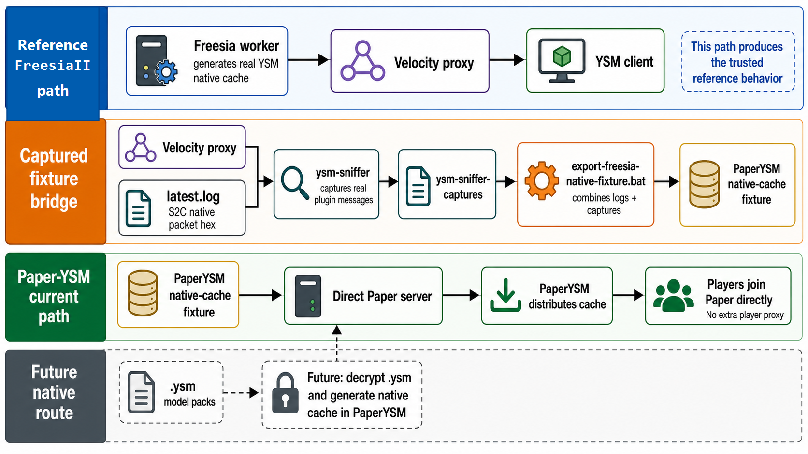

# PaperYSM Flow Diagram

This diagram summarizes the current Paper-YSM distribution plan compared with
the original FreesiaII path.

## What The Diagram Shows

- FreesiaII still owns the reference route: a Fabric Freesia worker generates
  real YSM native cache traffic.
- Velocity plus `ysm-sniffer` captures the real plugin-message exchange, while
  Freesia debug logs provide S2C native packet hex from `latest.log`.
- `scripts/sync-velocity-cache-to-paper.bat` combines
  `latest.log` and `ysm-sniffer-captures` into a PaperYSM native-cache fixture.
- A direct Paper server can distribute that cache with PaperYSM, so players do
  not need to join through the Freesia/Velocity proxy for normal test replay.
- The future route remains open: PaperYSM can later decrypt `.ysm` model packs
  and generate native cache directly, replacing the captured fixture dependency.

The generation prompt is stored in `docs/paperysm-flow.prompt.txt`.
