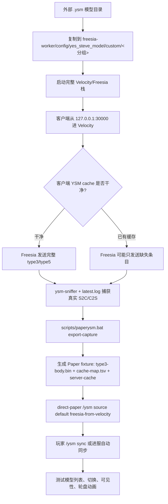

# PaperYSM 模型入库流程

当前推荐流程已经改成“真实 Velocity/Freesia 捕获优先”。不要再用 worker
`cache/server` 文件按目录顺序去手配 type3；刚才的测试已经证明那样会得到
可读名字但错误 cache body，客户端可能不回 type4，或者请求到的 token 对不上。



推荐命令：

```powershell
scripts\paperysm.bat copy-models "D:\BaiduNetdiskDownload\YSM模型（尽快保存下载） (2)\游戏IP分类" --group "游戏IP分类"
scripts\start-freesiaii-stack.bat
scripts\paperysm.bat export-capture
```

也可以使用短包装：

```powershell
scripts\sync-velocity-cache-to-paper.bat
```

导出后在 Paper 服里执行：

```text
/ysm source default freesia-from-velocity
/ysm sync
```

`export-report.tsv` 是验收重点：模型行需要有非空 file 且 `gaps=0`。
如果大量行没有 file，说明这次 Velocity/Freesia 捕获时客户端已经有缓存，
Freesia 没有重发对应 type5。要做可搬到其他客户端/服务器的完整 fixture，
需要清掉客户端 YSM cache 后重新进 Velocity 捕获。

旧图 `paperysm-ingest-flow.png` 是早期“worker 生成 cache 后再导出”的思路，
现在只作为历史记录。PaperYSM 的职责边界保持简单：Freesia/worker 负责产生
真实 native cache 和 type3/token map，PaperYSM 负责在 Paper 服分发 capture、
同步模型状态和桥接动画。`models-dir` 只作为动画映射和模型元数据参考，可以
指向 worker 的模型目录，也可以为空；为空时不影响已生成 cache 的分发，只是
部分模型动作可能无法映射播放。
