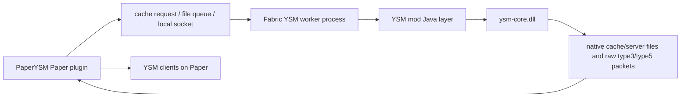

# PaperYSM Native Worker Bridge

## Current Answer

Trying to call `ysm-core.dll` directly from the Paper plugin is not a good
runtime path right now. The DLL does not export normal `Java_...` JNI symbols;
it registers native methods from `JNI_OnLoad`, and direct `System.load` outside
the real YSM mod runtime fails with `java.lang.RuntimeException: err: 56`.

The useful "real runtime" path is to let an actual Fabric/Forge YSM runtime load
`ysm-core.dll`, generate native server-cache bytes, and make PaperYSM consume
those bytes.

## Why Direct Paper DLL Loading Is Blocked

The real YSM Java layer expects a Fabric/Forge mod runtime:

- the loader class reads `YSM_CORE_LIB` and calls `System.load`;
- `JNI_OnLoad` dynamically registers obfuscated native methods;
- the server sync native entrypoints use YSM Java classes, player UUID/name
  arrays, native callbacks, and Minecraft/Fabric connection objects;
- the Paper plugin JVM does not have that class graph or lifecycle.

The local probe in `scripts\probe-ysm-native-core.bat` reproduces the direct
load failure before any cache-generation method can be called. That is close to
what a Paper-only plugin would face if it simply loaded the DLL.

## True Runtime Evidence

The existing test worker at `test-server\freesia-worker` is a real Fabric server
with:

- `mods\ysm-2.6.2-fabric+mc1.21.1-release.jar`
- `mods\Freesia-Worker-v1.0.2_YSM_2.6.2.jar`
- local custom models under `config\yes_steve_model\custom`
- native cache files under `config\yes_steve_model\cache\server`

`scripts\probe-worker-native-cache.bat` compares those worker cache files with
the Freesia-derived PaperYSM fixture. The Laffey model proves the important
point:

```text
fixture:
  captures\native-cache\freesia-latest\server-cache\b5ebabd1cfc7f2f956acf1fbccdea2f39aca01.bin
worker:
  freesia-worker\config\yes_steve_model\cache\server\7ba8305fb6883eb92fac6dba3815dd126eff2395
sha256:
  1F26F1E1E9BFDBFF9236B11353712212E0714D7EAEB14B28F95B9F35669615CE
bytes:
  868921
```

So the worker has already generated the exact native server-cache bytes that
PaperYSM can successfully replay from the Freesia fixture. The filename/token is
different, but the cache body bytes are identical.

## Bridge Shape

The practical architecture is:



For a first usable version, the bridge does not need to embed the DLL into
Paper. It only needs to:

1. copy/import `.ysm` files into the worker's YSM custom model directory;
2. trigger or wait for the worker/YSM runtime to refresh native cache files;
3. export the native server-cache bytes and enough manifest/token metadata;
4. let PaperYSM send the normal native cache replay to clients.

## Open Problem

The worker cache body for Laffey is solved, but a standalone cache body is not
enough for arbitrary generated distribution. PaperYSM also needs the matching
native type3 manifest token metadata for each cache entry. The current
`server_index` file in the worker cache directory is binary/native-owned, so the
next bridge task is to capture or decode the worker's type3/type5 emission from
the real YSM runtime instead of inventing a type3 manifest in Java.

## Recommended Next Implementation

1. Keep PaperYSM's pure Java generated-cache path as a diagnostic path only.
2. Add a worker-oracle import path that can consume real worker cache files and
   captured native type3 metadata.
3. Build a tiny worker-side capture mod or instrumentation hook around the
   native server sync callbacks, so we can export:
   - model id;
   - native request token;
   - server-cache body file/hash;
   - type3 manifest body.
4. Once that works, PaperYSM can stay Paper-only at runtime by serving exported
   oracle fixtures, while the optional worker is used only when new `.ysm`
   packs must be converted.
