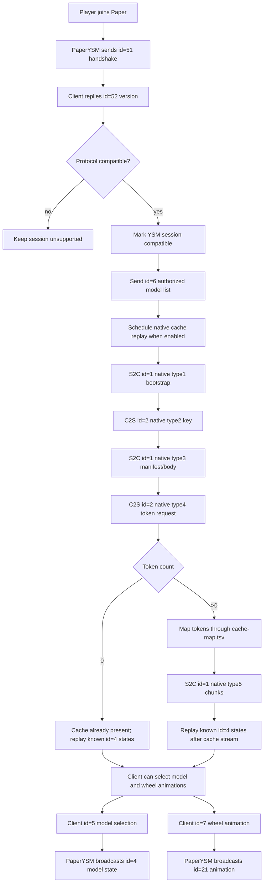

# PaperYSM YSM Sync Progress

## Current Status

PaperYSM now talks directly to YSM 2.6 clients on `yes_steve_model:2_6_0` without a Freesia Worker in the live path.

Implemented Java-layer packets:

- `id=51/52`: PaperYSM handshake and client version response.
- `id=6`: authorized model list sent after a compatible handshake.
- `id=4`: entity model-state broadcast for model/texture changes.
- `id=5`: client model selection, including server repository models and client/cache-local models.
- `id=7`: client wheel animation request.
- `id=21`: server animation broadcast generated from `id=7`.
- `id=1/2`: native/raw wrapper used by native cache replay.

Wheel animation notes:

- The 2.6 client `id=7` body is `action`, `name`, `targetEntityId`.
- Empty `name` requests are resolved through the selected model's `.ysm`
  `properties.extra_animation` profile table before broadcasting `id=21`.
- Debug logs include the requested action, client name, resolved server name,
  selected model, profile counts, and the fallback reason if resolution fails.

Implemented native cache replay:

- S2C native type1 bootstrap.
- C2S native type2 key decode.
- S2C native type3 manifest/body from the Freesia-derived fixture.
- C2S native type4 token request decode.
- S2C native type5 chunk stream from `cache-map.tsv` and `server-cache` files.
- Experimental generated cache command: `/paperysm dist ysmcache <player>
  [modelId|all] [intervalTicks] [chunkBytes] [legacy|keys]` builds encrypted
  cached-model bodies from local prepared `.ysm` packages instead of reading
  Freesia `server-cache` files. `legacy` is the current body that reaches
  type4/type5; `keys` tests the technical-report model where type3 carries
  ServerCacheKey/ClientCacheKey and type5 bodies are encrypted with
  ServerCacheKey.
- Player model selections are remembered in `player-models.yml` and restored
  after the next compatible handshake/cache replay.

The current test fixture is `captures/native-cache/freesia-latest`. Once a client receives this cache stream, model download progress appears, server/cache-local model selection works, and wheel animations can be seen by other YSM clients.

## Current PaperYSM Flow

## Differences From FreesiaII

FreesiaII keeps a real YSM runtime alive through a Fabric Worker and a proxy session. The Worker emits the original YSM packets, while the proxy relays or maps them between players and backend servers.

PaperYSM is taking the opposite approach: it reimplements the visible pieces inside a Paper plugin. There is no hidden Worker player, no proxy-side session lifecycle, and no full native YSM runtime. This makes the setup much simpler for a pure Paper test server, but it means PaperYSM must explicitly reproduce:

- handshake and authorized model list state;
- model selection and entity-state broadcast;
- wheel animation relay;
- native cache bootstrap, manifest, token request, and chunk stream;
- late state replay for players that join after another player has already selected a model.

## What YSMParser Contributed

YSMParser clarified how V3 `.ysm` packages are structured after decrypt/decompress: models, animations, textures, avatars, controller data, language files, and hashed path mappings. That explains why server-side sync is not just “send one `.ysm` file”; the native cache path has to advertise resource tokens and then serve the requested cache bodies.

The Freesia-derived cache fixture taught the runtime part of the protocol: type4 requests contain token bytes, and `cache-map.tsv` links those tokens to concrete server cache files. PaperYSM can now use that mapping to send type5 chunks.

The Yes Steve Model technical report adds one important constraint for the
generated path: packet type3 should establish the server/client cache key pair,
and the bytes sent in type5 are the server-cache form. The client then decrypts
that form with ServerCacheKey and writes its own ClientCacheKey-encrypted cache
file. That means a generated Paper path must eventually produce the real
server-cache bytes and not only a locally readable cache file.

## Remaining Work

- Generate the exact Freesia-compatible type3 manifest/body and cache entries
  directly from local `.ysm` packages instead of relying on Freesia fixtures.
- Validate the generated `ysmcache` type3 manifest against a real client and
  adjust key, entry, metadata/group/icon fields until the client requests the
  generated tokens and accepts the returned server-cache bytes.
- Replace the empirical native cache timing with a stricter session state machine.
- Track when each viewer has completed cache sync, then replay model state only after that viewer is ready.
- Expand `id=4` entity-state fields beyond the minimal model/texture body if future YSM features require it.
- Keep validating wheel animation action/name mapping against more FreesiaII captures.
