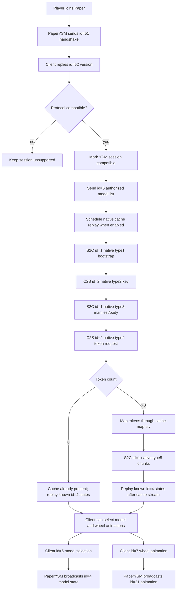

# PaperYSM YSM Sync Progress

## Current Status

PaperYSM now talks directly to YSM 2.6 clients on `yes_steve_model:2_6_0`.
The usable runtime path is intentionally conservative: a real Fabric/YSM or
Freesia worker generates the native cache material, Velocity/Freesia emits the
matching native type3/type5 stream, and PaperYSM replays that captured bundle to
Paper clients.

Implemented Java-layer packets:

- `id=51/52`: PaperYSM handshake and client version response.
- `id=6`: authorized model list sent after a compatible handshake.
- `id=4`: entity model-state broadcast for model/texture changes.
- `id=5`: client model selection, including server repository models and client/cache-local models.
- `id=7`: client wheel animation request.
- `id=21`: server animation broadcast generated from `id=7`.
- `id=1/2`: native/raw wrapper used by native cache replay.

Wheel animation notes:

- The 2.6 client `id=7` body is `action`, `name`, `targetEntityId`.
- Empty `name` requests are resolved through the selected model's `.ysm`
  `properties.extra_animation` profile table before broadcasting `id=21`.
- Debug logs include the requested action, client name, resolved server name,
  selected model, profile counts, and the fallback reason if resolution fails.

Implemented native cache replay:

- S2C native type1 bootstrap.
- C2S native type2 key decode.
- S2C native type3 manifest/body from the Freesia-derived fixture.
- C2S native type4 token request decode.
- S2C native type5 chunk stream from `cache-map.tsv` and `server-cache` files.
- Normal player command: `/ysm sync` replays the configured native cache source
  for the calling player. OPs can run `/ysm sync <player|all> [source]`,
  `/ysm source ...`, and `/ysm config speed ...`.
- Experimental generated cache command: `/ysm dist ysmcache <player>
  [modelId|all] [intervalTicks] [chunkBytes] [legacy|keys]
  [washed-zstd|headerless-v3|encrypted-v3]` builds encrypted
  cached-model bodies from local prepared `.ysm` packages instead of reading
  Freesia `server-cache` files. `legacy` is the current body that reaches
  type4/type5; `keys` tests the technical-report model where type3 carries
  ServerCacheKey/ClientCacheKey and type5 bodies are encrypted with
  ServerCacheKey. `washed-zstd` is the earlier payload shape; Freesia fixture
  analysis shows real server-cache plaintext is not zstd, so `headerless-v3`
  and `encrypted-v3` are now available to test headerless encrypted-model
  payloads directly.
- Player model selections are remembered in `player-models.yml` and restored
  after the next compatible handshake/cache replay.

The current direct-Paper test fixture is
`captures/native-cache/freesia-from-velocity`. It must be produced from a real
Velocity/Freesia capture, not by pairing worker cache files by directory order.
Once a client receives a complete captured cache stream, model download
progress appears, server/cache-local model selection works, and wheel
animations can be seen by other YSM clients.

## Current PaperYSM Flow

## Differences From FreesiaII

FreesiaII keeps a real YSM runtime alive through a Fabric Worker and a proxy session. The Worker emits the original YSM packets, while the proxy relays or maps them between players and backend servers.

PaperYSM is taking a narrower approach than FreesiaII. It does not keep a proxy
chain alive for normal players, but it also does not pretend the Java-generated
cache path is production-ready. The current product shape is:

- use Fabric/YSM/Freesia worker output as the native cache oracle;
- keep PaperYSM as the Paper-side distributor and state bridge;
- keep local `.ysm` parsing/cache staging as a research path for later.

This makes the setup much simpler for a pure Paper test server, but PaperYSM
must still explicitly reproduce:

- handshake and authorized model list state;
- model selection and entity-state broadcast;
- wheel animation relay;
- native cache bootstrap, manifest, token request, and chunk stream;
- late state replay for players that join after another player has already selected a model.

## What YSMParser Contributed

YSMParser clarified how V3 `.ysm` packages are structured after decrypt/decompress: models, animations, textures, avatars, controller data, language files, and hashed path mappings. That explains why server-side sync is not just “send one `.ysm` file”; the native cache path has to advertise resource tokens and then serve the requested cache bodies.

The Freesia-derived cache fixture taught the runtime part of the protocol: type4 requests contain token bytes, and `cache-map.tsv` links those tokens to concrete server cache files. PaperYSM can now use that mapping to send type5 chunks.

`cache-map.tsv` paths are resolved relative to the native-cache fixture root,
so `server-cache/<group>/<readable-name>.bin` works. The important invariant is
that every row must come from the same real Freesia native type3/type5 capture:
the token in type3, the `cache-map.tsv` row, and the server-cache body must all
match. Worker cache files copied by filesystem order are not trustworthy enough
for a client-visible fixture.

PaperYSM now keeps mapped server-cache files disk-backed while replaying a
native-cache fixture. It reads only the currently scheduled type5 chunk from
disk instead of loading every mapped cache body into a player session. The old
single-file `server-cache.bin` fallback still exists for legacy captures, but
large libraries should use `cache-map.tsv` entries.

For bulk imports, the supported path is capture-first:

1. copy one model group into
   `test-server/freesia-worker/config/yes_steve_model/custom/<group>`;
2. start the full Velocity/Freesia stack;
3. join through Velocity and let the real Freesia sync run;
4. run `scripts\paperysm.bat export-capture` or
   `scripts\sync-velocity-cache-to-paper.bat`;
5. test the exported fixture in direct Paper with `/ysm sync`.

For a full portable fixture, clear the client's YSM cache before joining the
Velocity/Freesia stack. If the client already has entries, Freesia may skip
their type5 bodies; the exporter will still write the real type3, but
`export-report.tsv` will show missing cache rows.

`scripts\export-worker-cache-batch.bat` remains as a research tool. Its direct
export action is blocked unless `--unsafe-order-pair` is provided, because the
previous order-pairing approach produced readable names but wrong cache bodies.

`scripts\paperysm.bat` is the preferred local entrypoint for the usable
workflow. It opens a Python menu for status checks, copying model groups into
the Freesia worker, starting the Freesia stack, exporting real Velocity/Freesia
captures, and inspecting type3.

PaperYSM no longer relies on junctions to make external model collections show
up under the YSM client browser. Copy model folders into the worker's real
`config/yes_steve_model/custom/<group>` directory. The Paper `models-dir`
setting is only an animation/model metadata reference; native cache replay can
still sync models when that directory is empty, but custom wheel animation
resolution may lose model-specific names.

The Yes Steve Model technical report adds one important constraint for the
generated path: packet type3 should establish the server/client cache key pair,
and the bytes sent in type5 are the server-cache form. The client then decrypts
that form with ServerCacheKey and writes its own ClientCacheKey-encrypted cache
file. That means a generated Paper path must eventually produce the real
server-cache bytes and not only a locally readable cache file.

The local Freesia fixture confirms the same distinction in practice: decrypting
the captured `拉菲Ⅱ/拉菲Ⅱ_v1.2.ysm` server-cache with the type3 ServerCacheKey
returns a non-zstd payload (`868095` bytes), while PaperYSM's original generated
path wrapped the local model's `washed-zstd` payload (`1313797` bytes). The
transport can reach type4/type5, but the native client will not register a GUI
model unless the cache plaintext shape matches what ysm-core expects. The
fixture analyzer also reports `headerlessV3 hashOk=false`, so this particular
server-cache blob is not just a local V3 `.ysm` body with the `YSGP` header
removed.

The latest `headerless-v3` generated-cache test reached type4 and streamed all
54 requested type5 chunks for the Laffey model, then replayed the saved model
state, but the client still did not show the model in the GUI. See
`docs/ysm-core-native-investigation.md` for the current DLL/native-core
investigation and recommended next route.

## Remaining Work

- Capture complete Velocity/Freesia oracle bundles for arbitrary model sets:
  type3 manifest/body, token map, and server-cache bodies.
- Validate the generated `ysmcache` type3 manifest against a real client and
  adjust key, entry, metadata/group/icon fields until the client requests the
  generated tokens and accepts the returned server-cache bytes.
- Replace the empirical native cache timing with a stricter session state machine.
- Track when each viewer has completed cache sync, then replay model state only after that viewer is ready.
- Expand `id=4` entity-state fields beyond the minimal model/texture body if future YSM features require it.
- Keep validating wheel animation action/name mapping against more FreesiaII captures.
